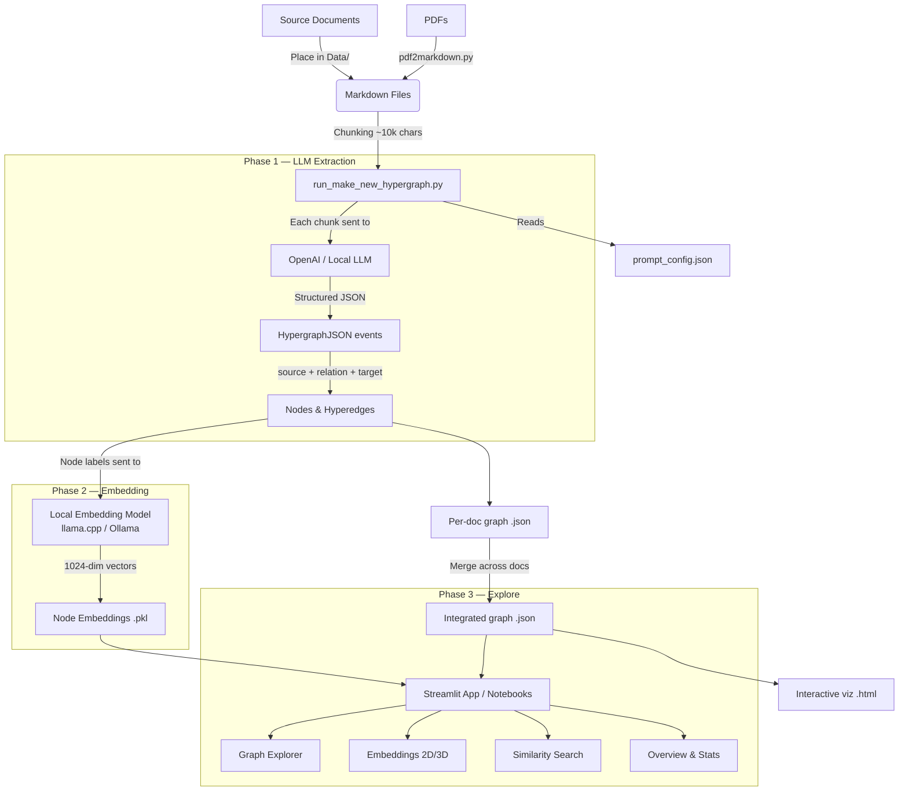

# HyperGraph — Knowledge Extraction via Hypergraph Reasoning

This repository builds on the methodology from:

**"Higher-Order Knowledge Representations for Agentic Scientific Reasoning"**
Isabella Stewart, Markus J. Buehler (MIT, 2026)

The pipeline ingests documents (markdown, PDF), uses an LLM to extract structured n-ary relationships (hyperedges), embeds every node with a local embedding model, and produces an interactive hypergraph you can explore, search, and reason over.

---

## Architecture



### What each phase does

| Phase | Tool | Purpose |
|-------|------|---------|
| **Extraction** | OpenAI API (or any OpenAI-compatible LLM) | Reads each text chunk, returns structured `{source, relation, target}` events |
| **Embedding** | Local BGE model via llama.cpp or Ollama | Converts every node label into a vector for similarity and clustering |
| **Exploration** | Streamlit app or Jupyter notebooks | Interactive visualization, search, community analysis |

---

## Repository Layout

```
HyperGraph/
├── GraphReasoning/          # Core Python package
│   ├── graph_generation.py  #   Hypergraph construction from LLM output
│   ├── graph_analysis.py    #   Analysis utilities
│   ├── graph_tools.py       #   Graph manipulation helpers
│   ├── prompt_config.py     #   Prompt template loader
│   └── utils.py             #   Shared utilities
├── scripts/
│   ├── run_hypergraph_to_viz.py     # Recommended: docs -> hypergraph JSON -> HTML
│   └── run_make_new_hypergraph.py   # Optional legacy/full pipeline (embeddings + integrated merge)
├── notebooks/
│   ├── 01_generate_hypergraph.ipynb # Generation workflow
│   ├── 02_analyze_hypergraph.ipynb  # Analysis & visualization
│   └── 03_agents.ipynb              # Multi-agent reasoning
├── app.py                   # Streamlit web UI
├── prompt_config.json       # All prompt templates (editable)
├── run_make_new_hypergraph.py  # Entrypoint (delegates to scripts/)
├── pdf2markdown.py          # PDF converter entrypoint
├── Data/                    # Place your source markdown files here
├── artifacts/
│   ├── sg/graphs/           # Per-document graph artifacts (.json)
│   ├── sg/html/             # Interactive visualization outputs (.html)
│   ├── sg/integrated/       # Merged graph artifacts (.json)
│   └── cache/chunks/        # Chunk-level cache
├── .env.example             # Environment variable template
├── pyproject.toml           # Package metadata & dependencies
└── requirements.txt         # Pinned dependencies for uv
```

---

## Prerequisites

- **Python >= 3.10**
- **[uv](https://docs.astral.sh/uv/)** — fast Python package manager
- **A local embedding server** — llama.cpp or Ollama
- **An LLM API key** — OpenAI, or any OpenAI-compatible endpoint

### Install uv

```bash
# Linux / macOS / WSL
curl -LsSf https://astral.sh/uv/install.sh | sh

# Windows (PowerShell)
powershell -ExecutionPolicy ByPass -c "irm https://astral.sh/uv/install.ps1 | iex"
```

### Set up an embedding server

The pipeline needs a local model to generate node embeddings. Choose one:

**Option A — llama.cpp (recommended for GPU acceleration):**

Download a GGUF embedding model (e.g., `bge-m3-Q8_0.gguf`), then:

```bash
./llama-server -m path/to/bge-m3-Q8_0.gguf --embeddings --port 8080
```

This is the default the pipeline expects (`http://127.0.0.1:8080`).

**Option B — Ollama:**

```bash
ollama pull nomic-embed-text
```

Ollama serves at `http://127.0.0.1:11434` by default. You'll need to pass `--bge-url` and `--bge-model` flags when running the pipeline.

---

## Quickstart

### 1. Clone and install

```bash
git clone <your-repo-url>
cd HyperGraph

uv venv
uv pip install -r requirements.txt
uv pip install -e .
```

### 2. Configure environment

```bash
cp .env.example .env
```

Edit `.env`:

```env
# OpenAI (or any OpenAI-compatible API)
OPENAI_API_KEY=sk-your-key-here
MODEL_NAME=gpt-4o
URL=https://api.openai.com/v1
```

For a local LLM (e.g., Ollama, vLLM, llama.cpp):

```env
OPENAI_API_KEY=NULL
MODEL_NAME=llama3.3
URL=http://localhost:8080/v1
```

### 3. Add your source documents

Place `.md` files in the `Data/` directory. To convert PDFs:

```bash
uv run python pdf2markdown.py input.pdf -o Data/output.md

# Or a whole directory
uv run python pdf2markdown.py /path/to/pdfs/ -o Data/
```

### 4. Start the embedding server

Make sure your embedding server is running before launching the pipeline:

```bash
# llama.cpp (default — port 8080, model bge-m3)
./llama-server -m path/to/bge-m3-Q8_0.gguf --embeddings --port 8080

# Or Ollama
ollama serve
```

### 5. Run the recommended pipeline (JSON + HTML)

```bash
# Default: reads Data/*.md, writes JSON hypergraphs + HTML visualization
uv run python scripts/run_hypergraph_to_viz.py --doc-data-dir Data
```

Optional flags:

```bash
uv run python scripts/run_hypergraph_to_viz.py \
  --doc-data-dir Data \
  --json-out-dir artifacts/sg/graphs \
  --html-out-dir artifacts/sg/html \
  --chunk-size 10000 \
  --chunk-overlap 0 \
  --overwrite
```

### 5b. Optional legacy/full pipeline (embeddings + integrated merge)

```bash
# Requires local embedding server (llama.cpp / Ollama)
uv run python run_make_new_hypergraph.py
```

You'll see logs like:

```
[config] model=gpt-4o | url=https://api.openai.com/v1
[config] thread=0/1 | merge_every=100
[generation] Building KG for doc 0: my_document
[llm] call #1 | model=gpt-4o | prompt_len=9454 chars | schema=HypergraphJSON
[llm] call #1 OK (attempt 1/7, 18.6s) | events=80
Generated hypergraph with 206 nodes, 80 edges.
```

The pipeline has two phases:
1. **LLM extraction** — sends each chunk to the LLM, gets back structured events (nodes + hyperedges)
2. **Embedding** — sends every node label to the local embedding model for vectorization

### 6. Explore results

**Streamlit web UI (recommended):**

```bash
uv run streamlit run app.py
```

The app has five tabs:

| Tab | What it does |
|-----|-------------|
| **Documents** | Load and manage source documents |
| **Pipeline** | Run the extraction pipeline from the UI |
| **Graph Explorer** | Pick a seed node, set hop distance, explore the hypergraph as an interactive force-directed network |
| **Embeddings** | UMAP/PCA projection (2D or 3D), HDBSCAN clustering, and cosine similarity search across all nodes |
| **Overview** | Graph-level stats: node count, edge count, degree distribution, edge size distribution, top connected nodes |

**Jupyter notebooks:**

```bash
uv run jupyter notebook notebooks/
```

| Notebook | Purpose |
|----------|---------|
| `01_generate_hypergraph.ipynb` | Step-by-step hypergraph generation |
| `02_analyze_hypergraph.ipynb` | Visualization and structural analysis |
| `03_agents.ipynb` | Multi-agent reasoning over the hypergraph |

### 7. Output artifacts

| Path | Contents |
|------|----------|
| `artifacts/sg/graphs/*.json` | Per-document hypergraph JSON |
| `artifacts/sg/html/*.html` | Interactive per-document hypergraph visualization |
| `artifacts/sg/integrated/*.json` | Merged graph across all documents |
| `artifacts/sg/graphs/hypergraph_embeedings.pkl` | Node embedding vectors (legacy/full pipeline only) |

---

## Pipeline CLI Reference

### Recommended (JSON + HTML)

```bash
uv run python scripts/run_hypergraph_to_viz.py \
  --doc-data-dir "Data" \
  --json-out-dir "artifacts/sg/graphs" \
  --html-out-dir "artifacts/sg/html" \
  --chunk-size 10000 \
  --chunk-overlap 0 \
  --llm-timeout 120.0 \
  --prompt-config "prompt_config.json" \
  --overwrite
```

| Flag | Default | Purpose |
|------|---------|---------|
| `--doc-data-dir` | `Data` | Markdown source folder |
| `--json-out-dir` | `artifacts/sg/graphs` | Hypergraph JSON output folder |
| `--html-out-dir` | `artifacts/sg/html` | Visualization HTML output folder |
| `--chunk-size` | `10000` | Characters per chunk |
| `--chunk-overlap` | `0` | Overlap between chunks |
| `--llm-timeout` | `120.0` | Timeout in seconds per LLM request |
| `--prompt-config` | none | Custom prompt template file |
| `--overwrite` | off | Rebuild JSON/HTML even if outputs exist |

### Legacy/full pipeline (embeddings + integrated merge)

```bash
uv run python run_make_new_hypergraph.py \
  --doc-data-dir "Data" \
  --artifacts-root "artifacts/sg" \
  --cache-dir "artifacts/cache/chunks" \
  --embedding-file "hypergraph_embeedings.pkl" \
  --bge-url "http://127.0.0.1:8080" \
  --bge-model "BAAI/bge-m3" \
  --chunk-size 10000 \
  --chunk-overlap 0 \
  --similarity-threshold 0.9 \
  --llm-timeout 120.0 \
  --llm-retries 6 \
  --llm-retry-delay 2.0 \
  --llm-max-delay 30.0 \
  --thread-index 0 \
  --total-threads 1 \
  --merge-every 100 \
  --prompt-config "prompt_config.json" \
  --no-ssl-verify \
  --skip-preflight
```

| Flag | Default | Purpose |
|------|---------|---------|
| `--bge-url` | `http://127.0.0.1:8080` | Embedding server address |
| `--bge-model` | `BAAI/bge-m3` | Embedding model name |
| `--chunk-size` | `10000` | Characters per chunk |
| `--chunk-overlap` | `0` | Overlap between chunks |
| `--llm-retries` | `6` | Max retry attempts per LLM call |
| `--llm-timeout` | `120.0` | Timeout in seconds per LLM request |
| `--thread-index` / `--total-threads` | `0` / `1` | For parallel processing across multiple workers |
| `--prompt-config` | `prompt_config.json` | Path to prompt template file |
| `--no-ssl-verify` | off | Disable SSL verification |
| `--skip-preflight` | off | Skip the API connectivity check |

---

## Prompt Configuration

All prompts are in `prompt_config.json`, organized into three sections:

| Section | Used for |
|---------|----------|
| `graph` | Directed graph extraction (binary `source → target` edges) |
| `hypergraph` | Hypergraph extraction (n-ary `source[] → relation → target[]` events) |
| `runtime` | Default system prompt for the pipeline, figure description prompts |

Override at runtime:

```bash
# Environment variable
export GRAPH_REASONING_PROMPT_CONFIG=path/to/custom_prompts.json

# Or CLI flag
uv run python run_make_new_hypergraph.py --prompt-config custom_prompts.json
```

---

## Structured Output Contract

### Hypergraph extraction (default)

```json
{
  "events": [
    {
      "source": ["TMS", "Munich warehouse", "DHL"],
      "relation": "routes_shipments_to",
      "target": ["customers in Austria", "48-hour SLA"]
    }
  ]
}
```

Each event becomes one hyperedge connecting all `source` and `target` nodes.

### Directed graph extraction

```json
{
  "nodes": [{"id": "...", "type": "..."}],
  "edges": [{"source": "...", "target": "...", "relation": "..."}]
}
```

---

## Optional Dependencies

```bash
# UMAP visualization (better clustering than PCA in the Embeddings tab)
uv pip install umap-learn

# HDBSCAN clustering (density-based, auto-detects cluster count)
uv pip install hdbscan

# PDF export
uv pip install pdfkit
# Also requires wkhtmltopdf installed and on PATH
```

---

## Troubleshooting

| Problem | Solution |
|---------|----------|
| `ModuleNotFoundError` | Run `uv pip install -r requirements.txt` again |
| No JSON/HTML generated | Confirm `.env` has `URL`, `MODEL_NAME`, `OPENAI_API_KEY` and rerun with `--overwrite` |
| `No markdown docs found` | Put `.md` files in `Data/` or convert PDFs first with `pdf2markdown.py` |
| SSL certificate errors | Use `--no-ssl-verify` or set `CERT_PATH` env var |
| Embedding server connection refused | Only needed for legacy/full pipeline; start llama-server or Ollama |
| UMAP fallback to PCA | Run `uv pip install umap-learn` |
| All nodes in one cluster | Install `hdbscan` (`uv pip install hdbscan`) or increase document count for more diversity |

---

## Citation

If this work contributes to your research, cite the original paper:

```bibtex
@article{stewartbuehler2025hypergraphreasoning,
  title     = {Higher-Order Knowledge Representations for Agentic Scientific Reasoning},
  author    = {I.A. Stewart and M.J. Buehler},
  journal   = {arXiv},
  year      = {2026},
  doi       = {https://arxiv.org/abs/2601.04878}
}
```
